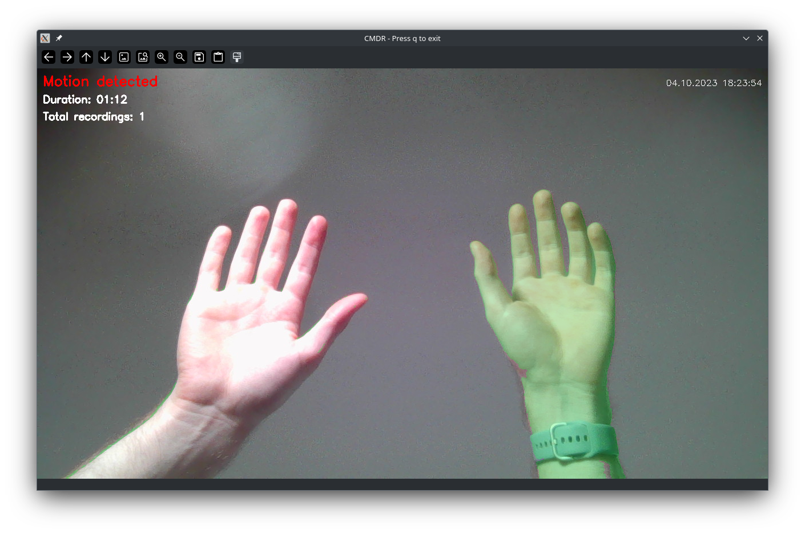

# Webcam Motion Detection and Recording

**Disclaimer:**

This program is fully functional, but it is still under development. The code will be restructured to be more modular, and comments and variables will be written in English rather than German in future updates. While the program works as intended, please be aware that there may be ongoing improvements and changes.

## Description

This repository contains a Python program that utilizes [OpenCV](https://github.com/opencv/opencv) to perform real-time motion detection using your webcam. It highlights and displays motion and also records video when motion is detected. You can set up motion detection with your webcam for security monitoring, creative projects, or any other application.



*Example: Moved left hand, right hand stationary. Detected and highlighted motion on the left hand and its shadow on the right forearm*

## Features

- Real-time motion detection using your webcam.
- Highlighting and visualization of detected motion in the video feed.
- Automatic video recording when motion is detected.
- Adjustable sensitivity and recording duration.
- Cross-platform compatibility: Windows, Linux, and macOS.

## Installation

### Prerequisites

Before you can use this program, you need to have Python and pip (Python package manager) installed on your system. Here's how to install them on Windows, Linux, and macOS:


#### Windows 

<details closed>
<summary>Details</summary>

1. **Python Installation:**
   - Visit the [Python Downloads](https://www.python.org/downloads/) page.
   - Download the latest Python installer for Windows.
   - Run the installer and check the option "Add Python X.X to PATH" during installation.

   **Note:** The "Add Python X.X to PATH" option adds Python to the system PATH environment variable, allowing you to use Python from the command prompt or other locations in the system without specifying the full path to the Python executable.

2. **Check if `pip` is correctly installed:**
   - Open Command Prompt (CMD).
   - Execute the following command to display the `pip` version:
     ```
     pip --version
     ```
   - If the command runs successfully and shows the `pip` version, it means that `pip` is already installed and ready to use.

   **Note:** `pip` is typically installed automatically along with Python when using the standard installation.
   
</details>


#### Linux (Ubuntu/Debian)

<details closed>
<summary>Details</summary>


1. **Python Installation:**
   - Open Terminal.
   - Install the python 3 Package e.g.:
     ```
     sudo apt-get update
     sudo apt-get install python3
     ```

2. **Pip Installation:**
   - Install the python3-pip package e.g.:
     ```
     sudo apt-get install python3-pip
     ```
     
</details>


#### macOS

   <details closed>
<summary>Details</summary>

1. **Python Installation:**
   - Visit the [Python Downloads](https://www.python.org/downloads/) page.
   - Download the latest Python installer for macOS.
   - Run the installer

2. **Check if `pip` is correctly installed:**
   - Open Command Prompt (CMD).
   - Execute the following command to display the `pip` version:
     ```
     pip --version
     ```
   - If the command runs successfully and shows the `pip` version, it means that `pip` is already installed and ready to use.

   **Note:** `pip` is typically installed automatically along with Python when using the standard installation.

</details>

### Program Installation

Now that you have Python and pip installed, follow these steps to install and run the program:

1. Clone this GitHub repository to your local machine or download the ZIP file and extract it.

2. Open a terminal or Command Prompt in project directory or Navigate to the project directory using the `cd` command.

3. Install the required Python packages by running the following command:
   ```
   pip install -r requirements.txt
   ```

## Usage

- Run the program by executing `python webcam_motion_detector.py` in the terminal or Command Prompt.
- The program will open a window displaying your webcam feed with motion detection and recording capabilities.
- Press 'q' or 'ESC' to exit the program.

Please be aware that if the program is unexpectedly or improperly terminated during recording, it may result in video file corruption. To prevent any potential issues caused by abrupt terminations, it's advisable to exit the program by pressing 'q' or 'ESC'.

## Configuration Options

The code is highly configurable, allowing you to adapt it to your specific needs:

- **Sensitivity**: You can adjust the sensitivity of motion detection by modifying the `sensitivitaet` variable in the code. A higher value makes the detection less sensitive, while a lower value makes it more sensitive.

- **Recording Duration**: Set the `aufnahme_dauer` variable to determine the duration of video recording after motion detection.

- **Recording Folder**: You can change the folder where recordings are saved by modifying the `aufnahme_ordner` variable.

- **Background Subtraction Algorithm**: The code includes two options for the background subtraction algorithm. You can choose between `cv2.createBackgroundSubtractorMOG2()` and `cv2.createBackgroundSubtractorKNN()`. The former provides more accurate results, while the latter may improve program performance.

- **Codec and Video Settings**: The `start_recording()` function allows you to modify video codec and other video settings as needed for your project.

- **Key Shortcuts**: The program listens for 'q' or 'ESC' key presses to exit, but you can change these key shortcuts if needed.

## Background Subtraction Algorithms

- The line `fgbg = cv2.createBackgroundSubtractorMOG2(history=50, varThreshold=20, detectShadows=False)` uses the MOG2 background subtraction algorithm. It provides accurate motion detection by modeling the background.

- Alternatively, the line `fgbg = cv2.createBackgroundSubtractorKNN(history=20, dist2Threshold=800.0, detectShadows=False)` uses the KNN background subtraction algorithm, which may offer better performance. However, it might be less accurate in certain scenarios.

You can choose the algorithm that best suits your project's requirements by uncommenting the respective line.


## Codec and Video Settings

This section provides an overview of the "Codec and Video Container Settings" in the project and how you can customize them to suit your specific needs. The project uses OpenCV for video recording, allowing you to choose the codec and video Container that best fits your requirements. Codecs determine the compression method used for video encoding.

### Customizing Video Settings
To customize the video settings, consider the following options:

- **Container Selection:** You can choose a codec that best suits your requirements. Common choices include MKV, MP4, AVI and others supported by OpenCV.
  
- **Codec Selection:** You can choose a codec that best suits your requirements. Common choices include X264, MP4V, XVID and others supported by OpenCV.

- **Frame Rate:** Adjust the frame rate as needed by modifying the value 20 in the cv2.VideoWriter function. For example, setting it to 30 would record at 30 frames per second.

- **Resolution:** The max_width and max_height parameters in the cv2.VideoWriter function determine the video frame's dimensions. It does not make sense to save a video in a higher resolution than what the webcam provides via OpenCV. But you can select a smaller resolution for your recordings than max_width and max_height.

### Container Formats

You can specify your preferred container formats by modifying the `preferred_containers` list at the beginning of the `start_recording` function in the code. The program will attempt to create video files in the order you specify, starting with the first format in the list.

For example, if you want to prioritize MKV and MP4 but also add AVI and MOV formats, set `preferred_containers` like this:

```python
preferred_containers = ['MKV', 'MP4', 'AVI', 'MOV']
```

### Customizing Codecs and File Extensions

While I have implemented X264 (MKV) and MP4V (MP4) as preferred options, you can choose any codec and container combination that suits your needs and is provided by OpenCV.


- **X264 (MKV):** This codec is chosen as the default option for its reliability. MKV files have a structure that can withstand unexpected program interruptions, ensuring your video files remain usable.

- **MP4V (MP4):** This codec is used as a fallback option in case the MKV format is not available. Please note that if the program is unexpectedly or improperly terminated during recording, the resulting video file may be rendered unusable.


To customize codecs and file extensions for your preferred container formats, you should extend the if-statements within the `start_recording` function in the code. Each container format should have its associated codec and file extension specified.

Here's an example of how to add support for AVI and MOV formats:

```python
if container_format == 'AVI':
    fourcc = cv2.VideoWriter_fourcc(*'XVID')  # Codec for AVI
    file_extension = '.avi'  # File extension for AVI
elif container_format == 'MOV':
    fourcc = cv2.VideoWriter_fourcc(*'H264')  # Codec for MOV
    file_extension = '.mov'  # File extension for MOV
# Add more container formats and codec/file extension pairs as needed
```

By following these steps, you can customize the supported container formats, codecs, and file extensions to meet your specific recording requirements. The program will attempt to create videos in the order you specify and with the associated settings for each format.

## License

This project is licensed under the MIT License - see the [LICENSE](LICENSE) file for details.

## Acknowledgments

Special thanks to the open-source community and the [contributors](https://github.com/opencv/opencv/graphs/contributors) of [OpenCV](https://github.com/opencv/opencv/) for making this project possible.

Happy motion detection and recording with your webcam!
